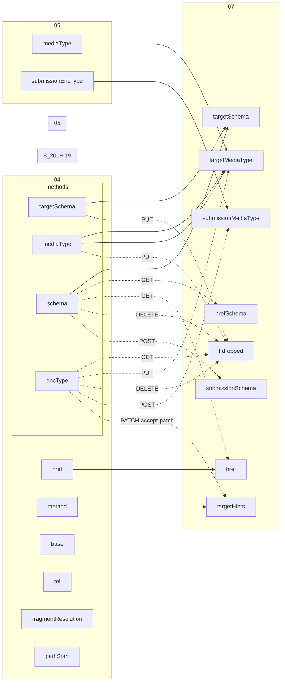

## Changes

```mermaid
graph LR

6.mediaType --> 7.targetMediaType
6.submissionEncType --> 7.submissionMediaType

4.href --> 7.href
4.targetSchema --> 7.targetSchema
4.mediaType --> 7.targetMediaType
4.method  --> 7.targetHints

4.schema --> 7.targetSchema
4.mediaType --> 7.targetMediaType

%% GET
4.schema -.GET.-> 7.hrefSchema
4.schema -.GET.-> 7.href
4.encType -.GET.-> 7.$drop

%% PUT

4.encType -.PUT.-> 7.targetMediaType
4.targetSchema -.PUT.-> 7.$drop
4.mediaType -.PUT.-> 7.$drop

%% DELETE
4.schema -.DELETE.-> 7.$drop
4.encType -.DELETE.-> 7.$drop

%% POST
4.schema -.POST.-> 7.submissionSchema
4.encType -.POST.-> 7.submissionMediaType

%% PATCH

4.encType -."PATCH accept-patch".-> 7.targetHints

subgraph 8_2019-19

end

subgraph 07
7.targetMediaType["targetMediaType"]
7.submissionMediaType["submissionMediaType"]
7.submissionSchema["submissionSchema"]
7.href["href"]
7.hrefSchema["hrefSchema"]
7.targetHints["targetHints"]
7.targetMediaType["targetMediaType"]
7.targetSchema["targetSchema"]
7.$drop["! dropped"]
end

subgraph 06
6.mediaType["mediaType"]
6.submissionEncType["submissionEncType"]
end


subgraph 05

end

subgraph 04

  subgraph methods 
    4.schema["schema"]
    4.encType["encType"]
    4.targetSchema["targetSchema"]
    4.mediaType["mediaType"]
  end
  4.base["base"]
  4.href["href"]
  4.rel["rel"]
  4.fragmentResolution["fragmentResolution"]
  4.pathStart["pathStart"]
  4.method["method"]
end


```

